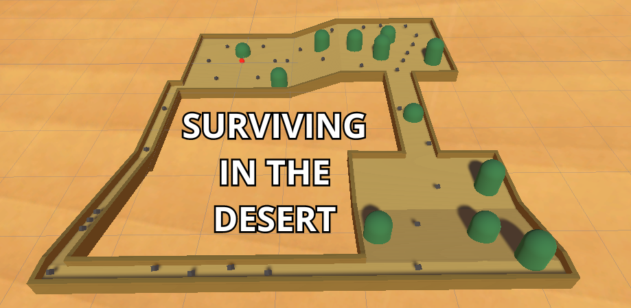

# RollABall

Aluna: Giovana Cassoni Andrade

## Capa do jogo

## Descrição do Jogo

Você, uma bolinha vermelha por estar queimada pelo sol, se encontra em algumas ruínas no deserto e não sobreviverá por muito tempo. Espalhadas pelas ruínas, há algumas caixas que possuem água e alimentos. Para sobreviver e ganhar, deve coletar todas as caixas. Mas cuidado! Não escoste nos cactos ou levará dano a sua vida.

## Jogo

### Como jogar:

- Para se movimentar, utilizar as teclas W, A, S, D ou os direcionais do teclado.
- Não encostar nos cactus (capsulas), caso encostar, leva 1 de dano.

### Objetivo:

- Coletar todos os pickups antes do tempo acabar.

## Referências

- Roll a ball tutorial: https://learn.unity.com/project/roll-a-ball

- Item Equip audio = picked: Sound Effect from <a href="https://pixabay.com/sound-effects/?utm_source=link-attribution&utm_medium=referral&utm_campaign=music&utm_content=6904">Pixabay</a>

- Videogame Death Sound audio = lose: Sound Effect from <a href="https://pixabay.com/sound-effects/?utm_source=link-attribution&utm_medium=referral&utm_campaign=music&utm_content=43894">Pixabay</a>

- success 1 audio = win: Sound Effect from <a href="https://pixabay.com/?utm_source=link-attribution&utm_medium=referral&utm_campaign=music&utm_content=6081">Pixabay</a>

- Desert image: https://www.google.com/search?client=ubuntu-sn&hs=cJ9&sca_esv=902ee0c3974bd986&sca_upv=1&channel=fs&sxsrf=ADLYWILuDbaO-veTBKGR1G1eLYE1N9PHJA:1726863467982&q=desert+skybox+unity&udm=2&fbs=AEQNm0AuaLfhdrtx2b9ODfK0pnmi046uB92frSWoVskpBryHTrdWqiVbaH6EqK0Fq9hkAkqRDuhGs7UQnPtZiL0Bzcj78aaFR2vnR4DfQyahVzxKNc6O6jBU8s5L6UmZFAuhQcGC7tCeR_nKdMS0tI-Jz-F_siZLnPsXH8NgAqtwgbKZiMn-bWDAzLoPCv03WGp892CpbpxhzkVXsroeF7EA0w5lU2qTzw&sa=X&ved=2ahUKEwjFstbcq9KIAxWcrJUCHRJhAmkQtKgLegQIDxAB&biw=1692&bih=860&dpr=1.09#vhid=-UnEMEZNaM8S-M&vssid=mosaic